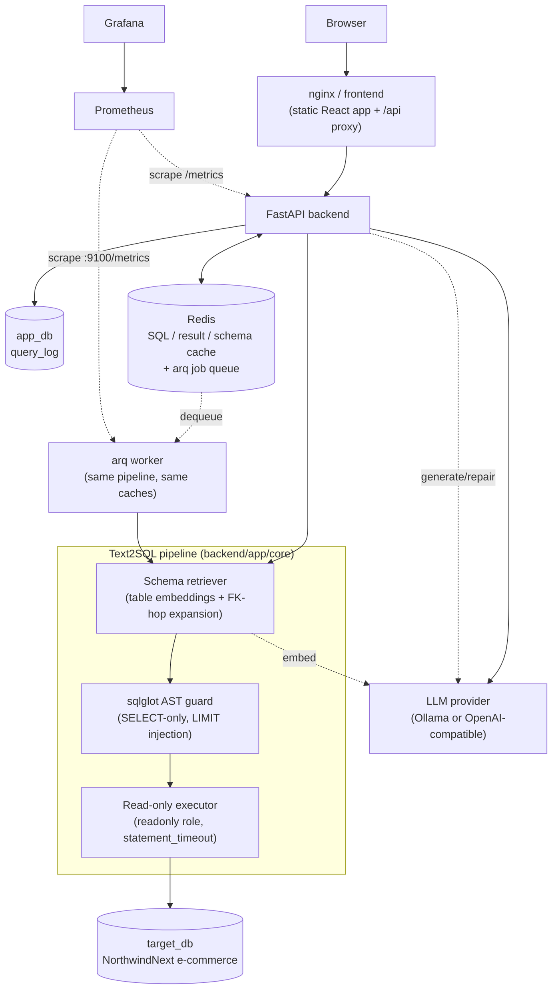

# Text2SQL

An open-source service that turns a natural-language question into a safe, read-only SQL query against a Postgres database, executes it, and returns results — built to showcase production infrastructure skills: containerised services, Kubernetes deployment, CI/CD, Redis caching, async job processing, Prometheus/Grafana observability, and Terraform-managed cloud infra. The LLM is pluggable (Ollama locally, any OpenAI-compatible API in the cloud) so the whole thing runs for free on a laptop with `docker compose up`.

<!-- CI badge lands here in Phase 3, once ci.yml exists. -->

## Architecture



Two Postgres roles behind two logical databases: `app_db` (read/write) holds
the app's own state — right now just the `query_log` table — and `target_db`
(the seeded NorthwindNext e-commerce data) is reached only through a
`readonly` role. The LLM provider is out-of-process and swappable; nothing
in `app/core` talks to it directly except through the `LLMClient` protocol.

Redis carries three caches and the job queue. The `worker` container runs
the identical pipeline the API does — same builder, same caches, same schema
version — so a background job answers exactly as the synchronous route
would, and reports the same metrics from its own `:9100/metrics`.
Prometheus scrapes both every 5 s and Grafana serves a provisioned
dashboard on top of it.

## Quickstart

```bash
git clone <this repo>
cd Text2SQL
cp .env.example .env
make up
```

Open http://localhost:5173, type a question, see the generated SQL and the
result table. The stack also publishes:

| URL | What |
|---|---|
| http://localhost:5173 | Frontend |
| http://localhost:8000/docs | API (OpenAPI UI); metrics at `/metrics` |
| http://localhost:9100/metrics | arq worker metrics (no UI — it serves nothing else) |
| http://localhost:9090 | Prometheus |
| http://localhost:3000 | Grafana → *Text2SQL overview* (anonymous viewer; `admin`/`admin` to edit) |

Every port is bound to `127.0.0.1` — nothing is reachable from the network.

`make up` starts Postgres (seeded on first boot), Redis, the backend, the
arq worker, the frontend, Prometheus, and Grafana — but *not* an LLM, so
`/api/v1/query` will fail with an `llm:` error until you point
`LLM_PROVIDER` at something reachable. Two options:

* **Local model:** `make up-ollama` instead of `make up`. This also starts
  an `ollama` service and pulls `qwen2.5-coder:7b` (generation) plus
  `nomic-embed-text` (embeddings) — **roughly a 5 GB download** the first
  time, and CPU inference is slow without a GPU.
* **Hosted, OpenAI-compatible API:** edit `.env`, comment out the Ollama
  `LLM_*` lines, uncomment the OpenAI block, and fill in `LLM_API_KEY`. Then
  `make up` (no `ollama` profile needed).

## How a query flows

1. **Retrieve** — embed the question, cosine-rank every table against it
   (plus a keyword boost if the question mentions a table/column by name),
   take the top-k, then expand one FK hop so joins are reachable.
2. **Render** — turn the retrieved tables into compact DDL-ish text (names,
   types, comments, foreign keys) for the prompt.
3. **Generate** — one LLM call with the rendered schema and the question;
   the response is parsed for a SQL statement and a plain-English
   explanation.
4. **Guard** — parse the SQL with `sqlglot`, reject anything that isn't a
   read-only `SELECT`/`WITH ... SELECT` over known tables, inject a `LIMIT`
   if one is missing.
5. **Execute** — run it on a dedicated read-only connection
   (`SET TRANSACTION READ ONLY`, a `statement_timeout`, a row cap on the
   fetched result).
6. **Repair (conditional)** — if execution fails with a plausibly-fixable
   error (bad syntax, unknown column), the pipeline makes exactly one more
   LLM call with the error message and retries guard + execute once. A
   `GuardError` never triggers a repair — the pipeline does not ask the LLM
   to "fix" a rejected statement.

Every run — success or failure — is logged to `query_log` in `app_db` with
the question, SQL, timing per stage, token usage, and whether a repair fired.

## Caching

Two Redis tiers sit in front of that flow, keyed by
`sha256(schema_version | model | prompt_version | normalised question)` — so
a schema refresh, a model swap, or a prompt change produces misses on its
own, with no invalidation to orchestrate:

* **SQL tier** (24 h, on by default) — a hit skips retrieve/generate but
  still re-guards and re-executes the statement, so the rows are always
  fresh.
* **Result tier** (5 min, opt-in per request with `"use_result_cache":
  true`) — a hit skips the database too.

A third tier stores the introspected schema graph and its embeddings
matrix, so a restart doesn't re-embed every table through the LLM. Every
response reports `cache_status` (`miss`, `sql_hit`, `result_hit`, `bypass`,
`disabled`) and the UI shows it as a badge; `"use_cache": false` bypasses
both query tiers. With Redis down every read is a miss and the API keeps
answering. See [ADR 0003](docs/decisions/0003-cache-design.md).

## Background jobs

`POST /api/v1/query/async` takes the same body as `POST /api/v1/query`,
returns `202 {job_id, status}`, and `GET /api/v1/jobs/{job_id}` polls for
the same `QueryResponse` under `result`. The work runs in the `worker`
container (arq on Redis), built from the same `build_components()` the API
uses, so the two cannot drift. A pipeline error (guard rejection, failed
statement, LLM outage) completes the job with the message in
`result.error`; `status="failed"` means the task itself raised. If Redis is
unreachable, both async routes answer 503 and the synchronous path keeps
working. See [ADR 0004](docs/decisions/0004-async-jobs.md).

## Metrics and dashboards

The pipeline reports every event (stage timing, LLM usage, guard rejection,
execution outcome, cache read) to a `PipelineObserver` protocol defined in
`app/core` — which knows nothing about Prometheus. The app layer's
`MetricsObserver` turns those into `t2s_*` collectors, exposed at
`/metrics` alongside `prometheus-fastapi-instrumentator`'s `http_*` ones:

```bash
curl -s http://localhost:8000/metrics | grep t2s_
```

LLM calls are labelled by stage — `generate`, `repair`, and `embed` (the
schema retriever's question and index embeddings) — with tokens and
estimated cost per model.

The arq worker runs the same pipeline, so it records the same `t2s_*`
collectors. Having no ASGI app to hang a route off, it serves them from a
WSGI daemon thread (`app/observability/exporter.py`) on
`WORKER_METRICS_PORT` — `9100` by default, published on localhost by
compose:

```bash
curl -s http://localhost:9100/metrics | grep t2s_
```

That endpoint doubles as the `worker` container's healthcheck, since it
only answers once the worker has finished building its components — unless
`METRICS_ENABLED=false`, in which case there is nothing to curl and the
check passes trivially rather than pinning the container to `unhealthy`.
Prometheus scrapes the endpoint as a second job, so the two processes'
series are distinguished by `job="text2sql-backend"` /
`job="text2sql-worker"`.

`WORKER_METRICS_PORT` in `.env` moves the worker's port, its compose
publication and its healthcheck together; the Prometheus scrape target in
`deploy/prometheus/prometheus.yml` is a static file and needs the matching
edit by hand.

`prometheus` scrapes both every 5 s; `grafana` provisions its datasource
and the *Text2SQL overview* dashboard from
[`deploy/grafana/`](deploy/grafana/) — LLM p50/p95 by stage, SQL success
rate, cache hit rate per tier, tokens per minute and estimated cost, queue
depth, HTTP p95, and guard rejections by reason. Labels are kept to a fixed
low-cardinality set (never question text, request id, or SQL — those go to
the structured logs). See
[ADR 0005](docs/decisions/0005-observability.md).

## SQL safety

The `sqlglot` AST guard (`backend/app/core/sql/guard.py`) is a UX layer, not
the security boundary. It parses candidate SQL with the Postgres dialect and
walks the tree: only a single `SELECT`/`WITH ... SELECT` (or a set operation
of selects) is accepted, every CTE body must itself be a select, and the
tree is scanned for DML/DDL nodes, `SELECT ... INTO`, row locks
(`FOR UPDATE`/`FOR SHARE`), and calls to a denylist of dangerous functions
(sleeps/timing oracles, filesystem access, `dblink*`, advisory locks,
sequence mutation, session/backend state) matched by exact name and by
prefix families so unenumerated variants fail closed too. Every table
referenced must be a known table (from the retrieved schema) or a CTE alias
visible in its own scope — an unqualified name can bind to a CTE, a
schema-qualified one can't. On acceptance, a `LIMIT` is injected or clamped
to `max_rows` on the outermost query only.

The real guarantee is one layer down: generated SQL only ever runs through
`execute_readonly` (`backend/app/core/sql/executor.py`), which opens a
connection on the Postgres `readonly` role, forces
`SET TRANSACTION READ ONLY` and a per-statement `statement_timeout` itself
(not relying on the role's own server-side defaults), and always rolls the
transaction back — it never commits. `sqlglot`'s Postgres dialect isn't
perfectly faithful to real Postgres and a denylist is inherently incomplete,
so treat any guard bypass as a UX bug, not a breach: the read-only role,
timeout, and row cap are what actually make a malicious or malformed
statement harmless.

## Switching LLM providers

Set these five env vars (see `.env.example`):

```bash
LLM_PROVIDER=ollama            # or "openai"
LLM_BASE_URL=http://ollama:11434
LLM_MODEL=qwen2.5-coder:7b
EMBED_MODEL=nomic-embed-text
LLM_API_KEY=unused
```

`LLM_PROVIDER=openai` selects `OpenAICompatClient`, which works with the
OpenAI API itself and anything that speaks the same wire format (Groq,
Together, vLLM, LM Studio, ...) — just point `LLM_BASE_URL` at it and set
`LLM_MODEL`/`EMBED_MODEL`/`LLM_API_KEY` accordingly. Both adapters implement
the same `LLMClient` protocol (`complete()`, `embed()`), so nothing else in
the pipeline changes.

## Running tests

Requires Python 3.12 and `pip install uv` (invoked as `python -m uv`).

```bash
make test      # cd backend && uv run pytest -q — needs Docker (testcontainers spins up real Postgres)
make lint      # ruff check, ruff format --check, mypy app — all in backend/
make fe-test   # cd frontend && npm test
```

`make test` runs both unit tests (guard, retrieve, render — pure functions,
no containers) and integration tests (the full pipeline against a real,
freshly-seeded Postgres with a `FakeLLM`, via `testcontainers`).

## Evaluation

`scripts/eval.py` runs every question in `seed/questions.yaml` through a
live `POST /api/v1/query` and reports two numbers: the percentage of
questions that came back executable (no pipeline error) and, among those
with a known `expect_rows`, the percentage whose `row_count` matched.

**These numbers were not measured during the Phase 1 build** — no LLM was
reachable on the build machine (the local Ollama model pull did not
complete, and no hosted API key was configured), so `eval.py` was
smoke-tested with `--dry-run` only. Once a provider is reachable, produce
real numbers with:

```bash
make up-ollama          # or configure the OpenAI block in .env, then `make up`
cd backend && python -m uv run python ../scripts/eval.py
```

This prints a per-question table (executable / row-match / latency /
tokens) plus:

```
executable: X/30 (P%)
row_match: Y/M (Q%)
```

and writes the full per-question results to `eval-results.json` (gitignored).
Add `--limit N` to try a handful of questions first, `--dry-run` to just
validate `questions.yaml` and print the question list without calling the
API, and `--api-url`/`--questions`/`--out` to point at something other than
the defaults.

## Load testing

```bash
make load-test
```

Runs [`scripts/load_test.js`](scripts/load_test.js) in the `grafana/k6`
container: 5 virtual users for 60 seconds against `POST /api/v1/query`,
walking ten questions copied from `seed/questions.yaml`. The walk is offset
per VU so the same question comes back around within the run — that is what
produces SQL-cache hits — and `use_cache` flips every other iteration, so
half the traffic bypasses the cache entirely and the hit-rate panel measures
only the requests that actually consulted it. Watch the Grafana dashboard
while it runs.

The k6 container reaches the API over `--network host`, which resolves
`127.0.0.1:8000` on Linux but not on Docker Desktop for macOS/Windows —
there, override the URL:

```bash
API_URL=http://host.docker.internal:8000 make load-test
```

With no LLM reachable the run still exercises the HTTP, schema-retrieval,
cache-miss and error paths (every request answers 200 with an `llm:` error
in the body), so the HTTP latency, success-rate and queue-depth panels move
and the cache hit rate plots a flat 0 % (nothing is cached, because a failed
run is never cached); only the token and cost series stay empty.

## Roadmap

This is Phase 2 of a four-phase plan — see [`PLAN.md`](PLAN.md) for the full
detail and the design-decision writeups (§4) that the ADRs in
[`docs/decisions/`](docs/decisions/) are drawn from:

* **Phase 1 (`v0.1`)** — core NL→SQL API, local `docker compose up`.
* **Phase 2 (this tag, `v0.2`)** — Redis two-tier query cache plus a schema
  cache, an arq job queue with async query endpoints, Prometheus metrics, a
  provisioned Grafana dashboard, and a k6 load test.
* **Phase 3 (`v0.3`)** — CI on every PR, multi-arch image releases to GHCR.
* **Phase 4 (`v1.0`)** — Kubernetes (k3d locally, Terraform-provisioned EKS
  in the cloud).

Known gaps carried out of Phase 2, both deliberate:

* A schema refresh applies to one process only — `POST /schema/refresh` for
  the API, `refresh_schema_job` for the worker. There is no cross-process
  invalidation yet.

## Project layout

```
Text2SQL/
├── backend/     # FastAPI app: core pipeline, LLM clients, API routes, tests
├── frontend/    # Vite + React + TS single-page UI
├── seed/        # NorthwindNext schema, generator, seed init container, eval questions
├── scripts/     # eval.py, load_test.js (k6)
├── deploy/      # prometheus.yml, Grafana datasource/dashboard provisioning
├── docs/        # architecture.md, demo.md, ADRs
├── docker-compose.yml
├── .env.example
├── Makefile
└── PLAN.md
```

## License

MIT — see [`LICENSE`](LICENSE).
